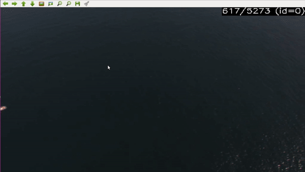

# Vessel Detection Project


There has been growing interest in the topic of maritime surveillance, specially due to the European migrant crisis. Frontex is an agency of the European Union that manages the cooperation between national border authorities securing Europe’s external borders. The surveillance of large portions of sea usually requires high investments and Frontex struggles with lack of equipment and human resources to perform an acceptable surveillance task by the detection and tracking of vessels in oceanographic airborne images.

## Labeling Tool

To support this research and development of the code we use a lebaling tool to help us on the vessel linearization. For the training and testing of vision algorithms it is necessary to use image sequences that where manually labeled.

The labeling task consists in tagging all objects in the image with a rectangle. Such operation needs to be done manually since the labeling is to be considered as the ground truth against which the results of the algorithms are compared. Any kind of error in the labeling process will have a negative impact in the performance of the algorithms and will compromise the reliability of the test results.




Dependencies:

- Requires OpenCV

- Requires cmake

To build the software:

```
mkdir build
cd build
cmake ..
make
```

To use the software:

```
build/labeling_tool <video_file>
```

Use `build/labeling_tool -h` to get command line help.

Press `h` while using the tool to get help.

Read the user manual at:

```
doc/manual_pt.pdf
```
      
Check the keyboard shortcuts map at:

```
doc/keyboard_map.pdf
```
